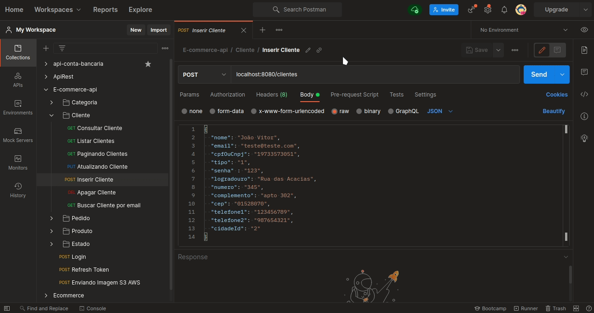
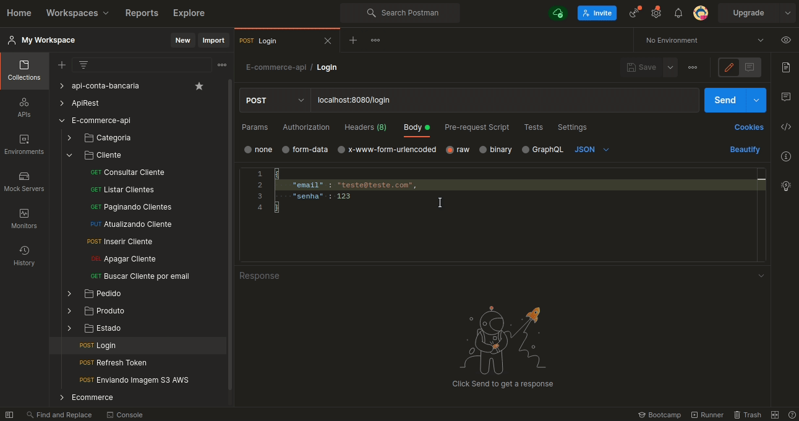
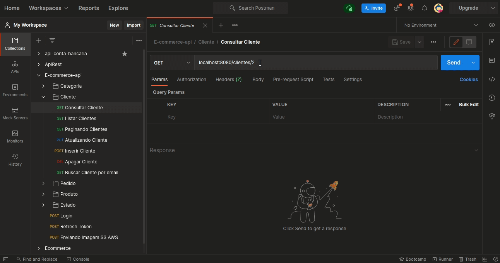
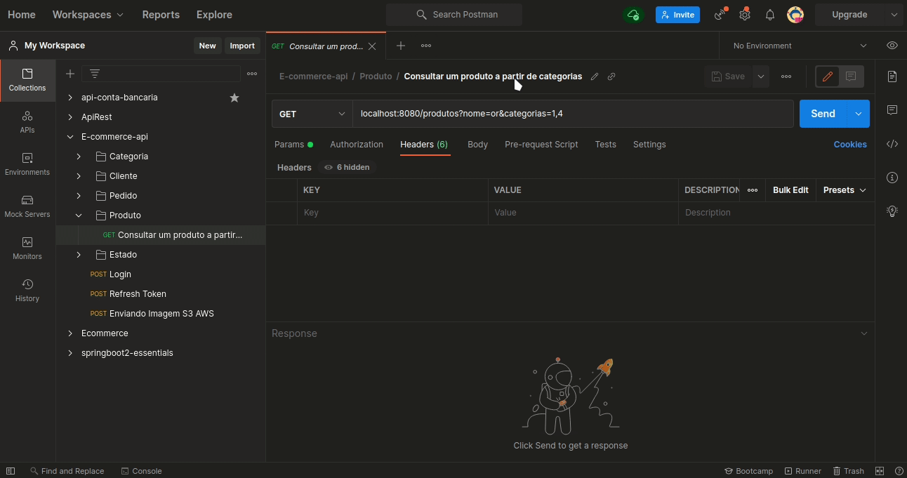
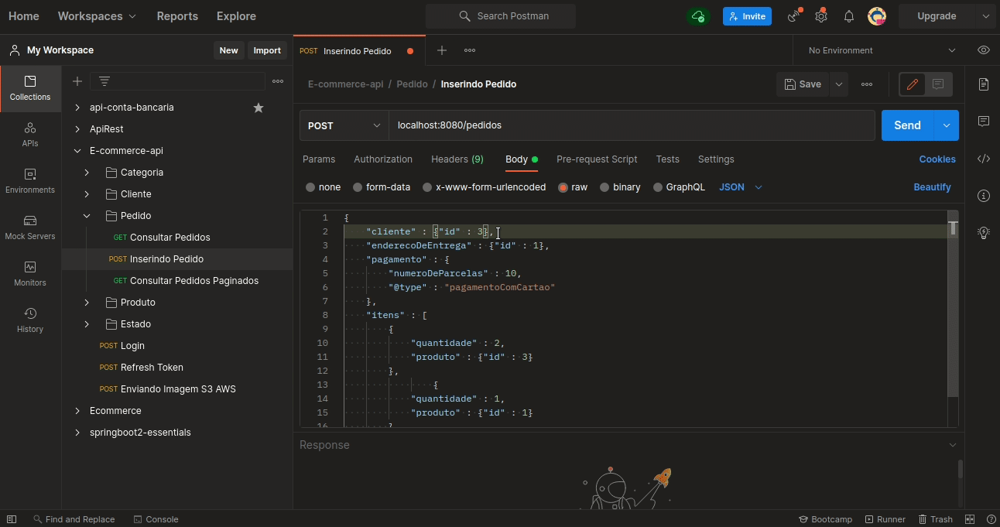
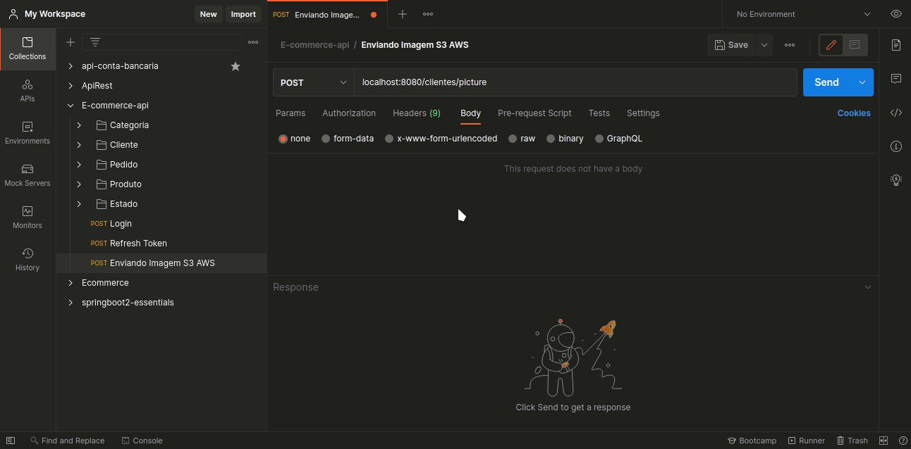

<h2 align="center">
  <p>🛍</p>
  <p style="margin:20px" >Projeto E-commerce-api</p>
</h2>

<h2>🧾 Sobre</h2>
<p> Projeto simples de estudo sobre uma API Rest usando Java com Spring Boot, Spring Data JPA, Spring Security e banco de dados MySQL/PostgreSQL/H2.Uso de JPA com Hibernate para mapeamento objeto-relacional, envio de email com SMTP da Google com JavaMailSender/MailSender e thymeleaf, armazenamento de imagens com storage S3 da Amazon, autenticação e autorização com tokens JWT.Também validação de dados Jakarta Bean Validation/Hibernate Validator, tratamento de exceções, uso adequado do protocolo HTTP no padrão REST, segurança, CORS e documentação com Swagger.E implantação na nuvem usando a plataforma Heroku.</p>

<h2>🔧 Ferramentas</h2>
<ul>
    <li>
    <a href="https://adoptopenjdk.net/" target="_blank"> Java 11</a>
    </li>
    <li>
    <a href="https://spring.io/projects/spring-boot" target="_blank">Spring Boot</a>
    </li>
    <li>
    <a href="https://spring.io/projects/spring-data-jpa" target="_blank">Spring Data JPA</a>
    </li>
    <li>
    <a href="https://spring.io/projects/spring-security" target="_blank">Spring Security</a>
    </li>
    <li>
    <a href="https://www.mysql.com/" target="_blank">MySQL</a>
    </li>
    <li>
    <a href="https://www.postgresql.org/" target="_blank">PostgreSQL</a>
    </li>  
    <li>
    <a href="https://www.h2database.com/html/main.html" target="_blank">H2</a>
    </li>
    <li>
    <a href="https://hibernate.org/orm/" target="_blank">Hibernate</a>
    </li>
    <li>
    <a href="https://docs.spring.io/spring-framework/docs/3.2.x/spring-framework-reference/html/mail.html" target="_blank">JavaMailSender</a>
    </li>
    <li>
    <a href="https://docs.spring.io/spring-framework/docs/3.2.x/spring-framework-reference/html/mail.html" target="_blank">MailSender</a>
    </li>
    <li>
    <a href="https://www.thymeleaf.org/" target="_blank">thymeleaf</a>
    </li>   
    <li>
    <a href="https://docs.aws.amazon.com/pt_br/AmazonS3/latest/userguide/Welcome.html" target="_blank">Amazon S3</a>
    </li>
    <li>
    <a href="https://jwt.io/" target="_blank">JWT</a>
    </li>
    <li>
    <a href="https://beanvalidation.org/" target="_blank">Jakarta Bean Validation</a>
    </li>
    <li>
    <a href="https://hibernate.org/validator/" target="_blank">Hibernate Validator</a>
    </li>
    <li>
    <a href="https://developer.mozilla.org/pt-BR/docs/Web/HTTP/Overview" target="_blank">protocolo HTTP</a>
    </li>
    <li>
    <a href="https://www.brunobrito.net.br/padrao-rest/" target="_blank">padrão REST</a>
    </li>
    <li>
    <a href="https://swagger.io/" target="_blank">Swagger</a>
    </li>
    <li>
    <a href="https://heroku.com/" target="_blank">Heroku</a>
    </li>                  
</ul>

<br/>
<h2>❓ Como funciona</h2>
<br/>

<p>Como essa api simula um e-commerce, você pode começar verificando os produtos e caso queira realizar um pedido deverá realizar um cadastro de um cliente e no header do response terá o recurso location com a uri do cliente que foi cadastrado através dela poderá buscar o cliente para ter acesso a informações caso necessário não esqueça de informa um email válido quando cadastrar um cliente, pois quando realizar um pedido será enviado a confirmação do pedido no e-mail do cliente, sendo assim poderá fazer o login no sistema onde o response retornará no header o Authorization com um token para você conseguir fazer o pedidos e ter acesso aos demais endpoints do sistema.</p>
<br/>

<h1>Cadastrando cliente</h1>
<h1>
  
</h1>

<h1>Fazendo login</h1>
<h1>
  
</h1>

<h1>Buscando o cliente</h1>
<h1>
  
</h1>

<h1>Busca paginada de produtos</h1>
<h1>
  
</h1>

<h1>Realizando um pedido</h1>
<h1>
  
</h1>

<h1>Consultando um pedido</h1>
<h1>
  
</h1>

<h1>Envio do profile de imagem do cliente</h1>
<h1>
  
</h1>

<p>Por favor verifique a documentação da api para saber os recursos disponíveis.</p>

<br/>
<h2>Observações Importantes:</h2>
<p>A configuração do application.properties está no profile de test onde o serviço de e-mail é mockado e mostrado apenas como log no console, caso queira testar o serviço de e-mail tera que altera o application.properties selecionando o profile de dev ou prod e terá que colocar manualmente as informações de :</p>

```bash
  # application.properties
  
  ##email de quem está enviando
  default.sender=email@teste.com

  ##email destino
  default.recipient=email@teste.com

  ##configuração para usar o smtp do google para enviar email
  spring.mail.host=smtp.gmail.com
  ##email de que esta enviando
  spring.mail.username=email@teste.com
  ##senha do e-mail
  spring.mail.password=senha
  spring.mail.properties.mail.smtp.auth= true
  spring.mail.properties.mail.smtp.socketFactory.port= 465
  spring.mail.properties.mail.smtp.socketFactory.class=javax.net.ssl.SSLSocketFactory
  spring.mail.properties.mail.smtp.socketFactory.fallback= false
  spring.mail.properties.mail.smtp.starttls.enable=true
  spring.mail.properties.mail.smtp.ssl.enable= true
```

<br/>
<p>Também por motivos óbvios o serviço de upload de imagem na s3 também não está configurado, caso tenha cadastro na aws e queira testar o serviço da s3 configure ás informações no  application.properties :</p>

```bash
  ##CONFIGURAÇÃO S3 AWS
  aws.access_key_id=
  aws.secret_access_key=
  s3.bucket=name-bucket
  3.region=sa-east-1

```

<br/>
<h2>👨‍💻 Como configurar para rodar aplicação localmente</h2>
<p>Você pode pegar todos os arquivos deste site e executá-los apenas no seu computador como se estivessem online, apenas na sua máquina.</p>
<br/>

```bash
  # Clone o projeto
  $ git clone https://github.com/joaovitor-cbc/E-commerce-api.git
```

```bash
  # Vá até a pasta do arquivo pelo terminal
  # Ex: Linux
  $ cd /home/name_user/Download/E-commerce-api
```
<br/>
<h2>🚨 ATENÇÃO: VERIFIQUE SE TEM O JAVA NA VERSÃO 11 INSTALADO E CONFIGURADO NA SUA MÁQUINA. 🚨</h2>
<br/>

<p>Verifique se tem o Maven instalado</p>

```bash
  # obs: verifique se tem o Maven instalado através do terminal 
  $ sudo mvn --version
```

<br/>
<p>Caso não tenha, instale o Maven</p>

```bash
  # Ex : apt
  $ sudo apt install maven
```

<br/>
<p>Com Maven instalado siga o passo a passo através do terminal</p>

```bash
  # remove todos os arquivos gerados pela compilação anterior 
  $ sudo mvn clean
```

```bash
  # instale o pacote no repositório local, para uso como uma dependência em outros projetos localmente. 
  $ sudo mvn install
```

```bash
  # pegue o código compilado e empacote-o em seu formato distribuível, como um JAR.  
  $ sudo mvn package
```
<br/>
<h2>🧐 Dica</h2>

<p>Muito provavelmente o pacote .jar que foi gerado tem esse nome: 
ecommerceapi-0.0.1-SNAPSHOT.jar</p>
<p>Caso queria vê através do terminal o nome do pacote jar que foi gerado
execute os seguintes comandos.</p>

<p>❗ obs: esteja dentro da pasta raiz do projeto.
Ex: /home/name_user/Download/E-commerce-api</p>
<br/>

```bash
  # Vá até a pasta target 
  $ cd /home/name_user/Download/E-commerce-api/target
```
```bash
$ ls
# Será exibido o nome do pacote .jar 
classes                                   maven-archiver
ecommerceapi-0.0.1-SNAPSHOT.jar           maven-status
ecommerceapi-0.0.1-SNAPSHOT.jar.original  surefire-reports
generated-sources                         test-classes
generated-test-sources

```

<h2>Para rodar o programa através do terminal</h2>
<p>❗ obs: esteja dentro da pasta raiz do projeto.
Ex: /home/name_user/Download/E-commerce-api</p>

```bash  
  $ sudo mvn spring-boot:run
```

<p>Ou também.</p>

```bash  
  $ sudo java -jar -Dapple.awt.UIElement="true" target/ecommerceapi-0.0.1-SNAPSHOT.jar -h
```
<p>❗obs: Caso de erro verifique o nome do pacote .jar.
Ex: cd /home/name_user/Download/E-commerce-api/target</p>

<br/>
<h2>✨ Dica de ouro</h2>

<p>Caso queira encerrar a execução do programa no terminal pressione Ctrl+c</p>

<br/>
<h2>🧾 Para acessar a documentação</h2>
<a href="https://heroku-e-commerce-api.herokuapp.com/swagger-ui.html" target="_blank">Clique aqui</a>
<br/>
<br/>
<h2>📝 Licença</h2>
<p> Este projeto está sob a licença do Apache License 2.0. Veja o arquivo<a href="https://www.apache.org/licenses/LICENSE-2.0"> LICENCE </a>para maiores detalhes.</p>

<p align="center">Feito por<a href="https://www.linkedin.com/in/joão-vitor-araujo"> João Vitor</a></p>


